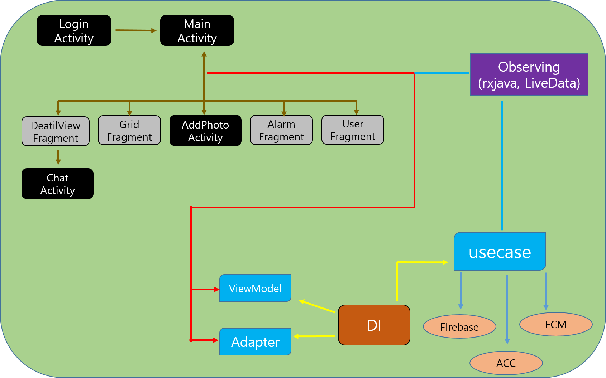
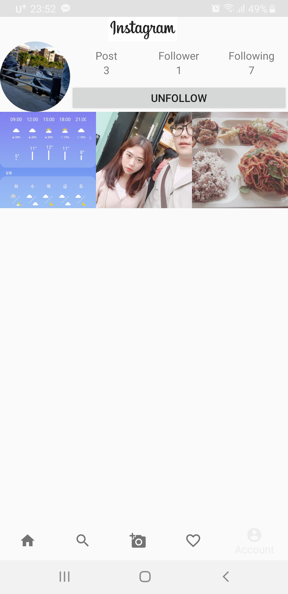
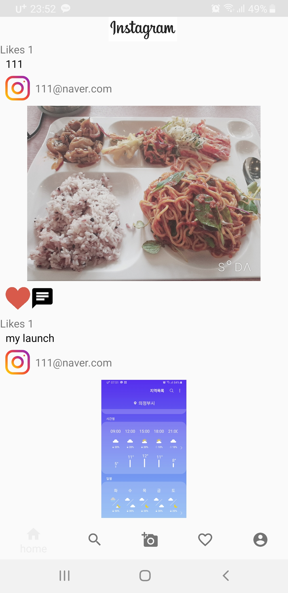
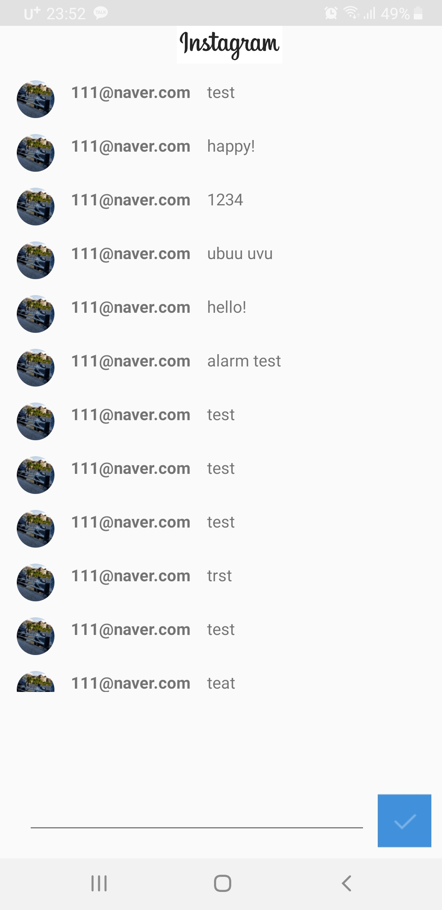

# GyunStagram

InstaGram Clone MiniProject

## Technology set

language      :  Kotlin

Architecture  :  MVVM

reactive      :  Rxjava , LiveData

DI            :  Koin 2.0

DB            :  Firebase

Notification  :  FCM

## image

### Architecture

### InApp

